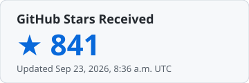

### Hi, I'm miniLV  👋
**Senior iOS / macOS Engineer · Xiamen, China**

A decade in Apple ecosystem development — from Objective-C runtime internals to modern SwiftUI, and now exploring AI-assisted engineering workflows.

About Me

Blog：[小蠢驴打代码](https://minilv.github.io/)

掘金：[小蠢驴打代码](https://juejin.im/user/5a0a82ac6fb9a04515436530)

<!--
**miniLV/miniLV** is a ✨ _special_ ✨ repository because this README.md (this file) appears on your GitHub profile.

Here are some ideas to get you started:

- 🔭 I'm currently working on ...
- 🌱 I'm currently learning ...
- 👯 I'm looking to collaborate with ...
- 🤔 I'm looking for help with ...
- 💬 Ask me about ...
- 📫 How to reach me: ...
- 😄 Pronouns: ...
- ⚡ Fun fact: ...
-->
